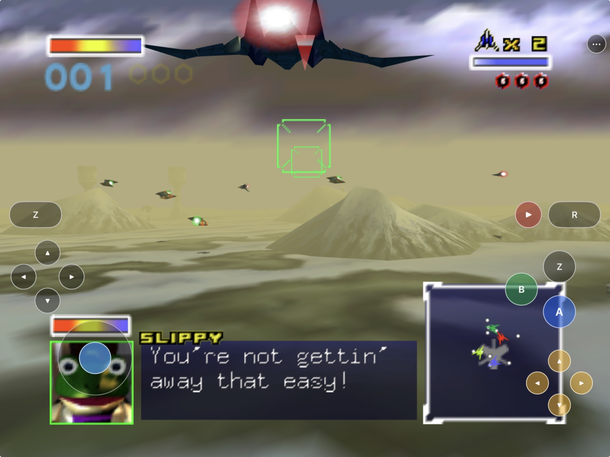
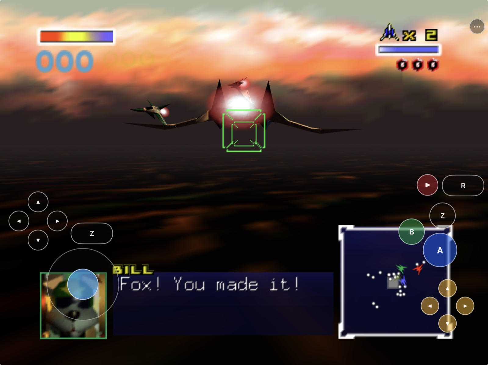
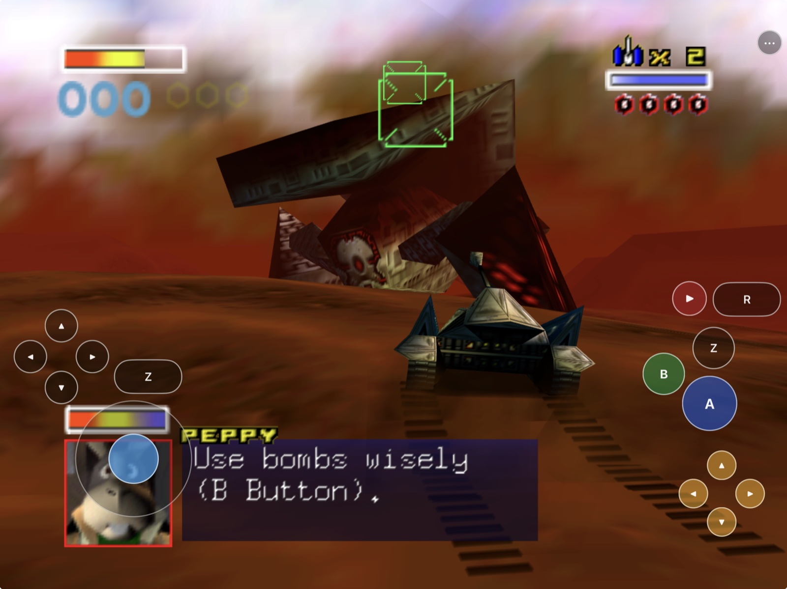
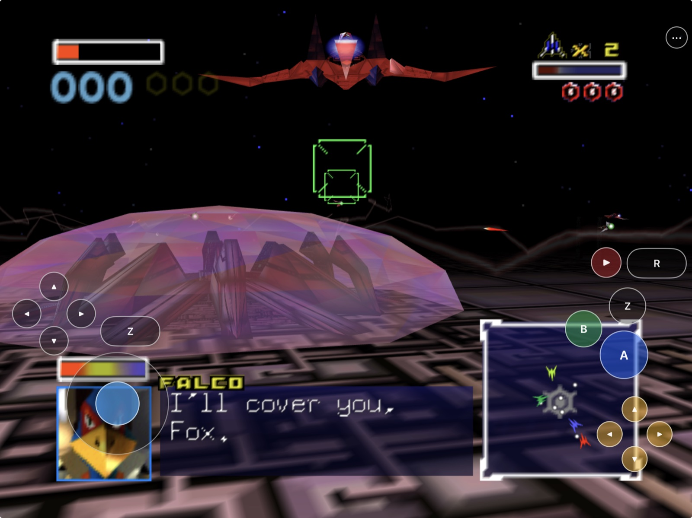
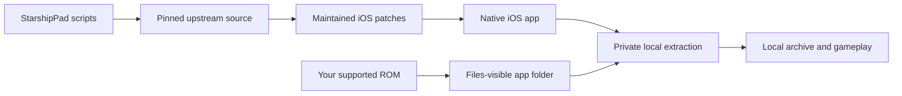

# StarshipPad

<p align="center">
  <strong>Starship (Star Fox 64), adapted for iPhone and iPad as StarshipPad.</strong><br>
  Native Metal rendering, touch flight controls, native controller input,
  Files-based setup, and separate experimental phone and tablet layouts.
</p>

<p align="center">
  <a href="https://github.com/chrissotraidis/starshippad/actions/workflows/ios-build.yml"></a>
  
  
  
  
  
</p>



<p align="center">
  <sub>Current iPad Simulator capture. Game data was supplied locally and is
  not included in this repository or its build artifacts.</sub>
</p>

StarshipPad turns the complete
[Starship](https://github.com/HarbourMasters/Starship) source port into a
native iOS/iPadOS application. Build it on a Mac, import your own supported
Star Fox 64 ROM through Files, and fly by touch or connect a compatible
controller—no keyboard required.

This repository contains the mobile integration, maintained source patches,
tests, and reproducible build scripts. It does **not** contain Star Fox 64, a
ROM, extracted Nintendo assets, or a playable ROM-derived archive.

## Install status

| Option | Status | What it means |
|---|---|---|
| Local signed iPhone/iPad build | **In device testing** | The current development build has been signed, installed, and launched on a physical iPhone 14 and 12.9-inch iPad Pro |
| Simulator | **Tested** | Best path for repeatable development and UI validation; it does not prove physical control feel |
| Unsigned `.ipa` | **Preview 5 available** | ROM-free download for advanced users to sign themselves; it cannot use the standard device-install path as published |
| Public signed download | **Not available** | No official downloadable signed build is published |
| App Store / TestFlight | **Not announced** | No listing or public beta exists |

## Download Preview 5

Previous builds have been retired; a new version is in progress.

SHA-256: `a57ed4bd149e8cfaf791b620681c69aeb32371d79d7242c18845832c65b57892`

This preview is ROM-free and unsigned. It is **not directly installable** on a
standard iPhone or iPad as downloaded; you must sign it with your own Apple
development identity and provisioning profile. Star Fox 64 game data is never
included and must be imported separately from your own legally acquired
supported ROM.

The current development build has also reached gameplay on both attached
devices. The accepted iPad controls are working well in hands-on testing. The
experimental phone layout is usable and persists its separate configuration,
and the compact settings interface now uses a readable scale, larger touch
targets, and direct swipe scrolling. The latest far-right Menu-over-Start
phone default has passed Simulator interaction checks and still requires
physical-device acceptance. Phone control comfort, audio routes, controller
models, reconnect, rumble, thermals, and sustained performance remain open
validation work.

Simulator Files import, extraction, cached relaunch, lifecycle persistence,
and the full default touch-action matrix have passed. An unsigned arm64
iPhoneOS build and ROM-free package audit also pass. The workflow badge above
shows the current hosted-CI result; detailed engineering evidence and open
hardware gates remain recorded in
[`docs/remaining-work.md`](docs/remaining-work.md).

Preview 5 retains the compact iOS diagnostic breadcrumbs introduced in
Preview 3 and repairs stale SDL2 controller ownership in LibUltraShip's
existing ControlDeck. Valid connected devices retain their player port;
detached handles are closed, held input is cleared, a sole returning physical
controller reclaims Player 1, and additional controllers take the next free
port. Reconciliation runs at startup, controller events, foreground resume,
and a bounded active check without restarting the controller subsystem.

The rolling iOS diagnostics flush immediately to the
existing rolling `Documents/logs/Starship.log`. Session, lifecycle, game,
mission, player, and cutscene state changes are recorded alongside periodic
heartbeats. The signed build was installed and run on the physical iPad with
the ROM, extracted archive, save, touch layout, and preferences preserved;
the controller configuration retained every existing value and added default
SDL mappings for the newly usable secondary player ports.

## Get started

You need:

- a Mac with Xcode and its command-line tools;
- [Homebrew](https://brew.sh);
- your own legally acquired supported Star Fox 64 ROM;
- optionally, an iOS-compatible extended gamepad over Bluetooth or USB; and
- an Apple ID configured in Xcode only if you want a physical-device build.

Install build dependencies:

```sh
brew install cmake ninja pkgconf sdl2 glew nlohmann-json libzip \
  tinyxml2 libogg libvorbis
```

Clone and build:

```sh
git clone https://github.com/chrissotraidis/starshippad.git
cd starshippad

# iPad/iPhone Simulator
scripts/build-ios.sh --simulator

# Unsigned physical-device product
scripts/build-ios.sh --device
```

For a personally signed build:

```sh
DEVELOPMENT_TEAM=ABCDE12345 \
BUNDLE_ID=com.yourname.starshippad \
scripts/build-ios.sh --device
```

Replace `ABCDE12345` with your 10-character Apple development-team identifier
and use a bundle identifier registered to you. The Simulator and device
products are written to:

```text
build-ios-sim/Release-iphonesimulator/StarshipPad.app
build-ios/Release-iphoneos/StarshipPad.app
```

See
[`docs/BUILDING.md`](docs/BUILDING.md) for installation, signing, controller,
and package-audit details.

## First flight

StarshipPad never downloads or bundles game data. Use a supported US
Star Fox 64 1.0 or 1.1 ROM to create the base local archive; supported
Japanese, European, Spanish, and Chinese ROMs are optional voice-pack inputs.

1. Launch StarshipPad once so iOS creates its Files-visible folder.
2. Open **Files → On My iPhone/iPad → StarshipPad**.
3. Move your supported `.z64`, `.v64`, or `.n64` file into that folder. The
   filename does not matter.
4. Return to StarshipPad and choose **Rescan**.
5. Keep the app foregrounded while it creates the private local archive.
6. Press the on-screen Start control when the title screen appears.

Supported regional inputs are routed to the Voice Pack path instead of being
treated as an unsupported base ROM. Extraction and generated data stay in the
app container. **Settings → Language → Voice Pack** scans only for a supported
regional ROM and installs it in the background; it never rebuilds the US base
archive.

## Controllers

StarshipPad uses Apple's native GameController framework through SDL. Pair a
compatible extended gamepad with iOS over Bluetooth or connect one by USB,
then launch the game—there is no StarshipPad-specific driver or pairing step.

- **Connect and play:** iOS-recognized MFi, Xbox, PlayStation, and other
  SDL-compatible extended gamepads use the standard controller path.
- **Automatic takeover:** a physical controller becomes Player 1 and analog
  touch pauses; disconnecting it restores analog touch automatically.
- **Stable reconnect:** stale handles are closed, held buttons and axes are
  released, and a returning controller reclaims its available player port.
- **Multiple players:** additional physical controllers take the next free
  player port without moving Player 1.
- **Native mapping:** review or rebind controls under
  **Settings → Controller → Controller Mapping**.
- **Touch stays available:** the visible touch buttons continue through their
  keyboard fallback while a physical controller is connected.

Compatibility ultimately depends on iOS recognizing the device and exposing
an Extended Gamepad profile. Deterministic fake-SDL coverage proves ownership,
neutral input, and foreground reconciliation; individual physical Bluetooth,
wired, natural-sleep, full-mapping, rumble, and two-controller scenarios remain
hardware-validation items.

## Touch controls

The default flight deck is arranged for a landscape device held at both
edges. It starts with HarkinianPad's native-button, pass-through-overlay,
safe-area, and persistent-menu mechanism, then applies Starship-specific
bindings and continuous analog flight input.

- **Left grip:** bank-left Z, full D-pad, and analog flight stick.
- **Right grip:** R and Pause, A/B/Z face cluster, and the yellow C-button
  action diamond.
- **C diamond:** View up, Brake down, Boost left, Talk right.
- **Menu:** `•••` remains available even when gameplay controls are hidden.
- **Toggle:** **Settings → Controller → Touch Controls** removes or restores
  gameplay controls without a restart.
- **Customize:** enable **Experimental Custom Touch Layout**, then choose
  **Customize Touch Layout** to move, resize, or hide controls. Phone and
  tablet configurations are stored separately.
- **Default:** disabling the experiment immediately restores the accepted
  fixed layout without deleting the saved custom profiles.
- **Fallback:** disabling Analog Touch preserves the complete eight-way
  keyboard path.

| Touch control | Action |
|---|---|
| Stick | Analog flight and aiming |
| A | Fire; hold for charge shot |
| B | Bomb |
| Z / R | Bank left/right; ordinary double-tap for barrel roll |
| C-Left / C-Down | Boost / Brake |
| Boost + stick-down | Somersault |
| Brake + stick-down | All-range U-turn |
| C-Up / C-Right | View / answer wingman |
| Start | Pause |
| D-pad | Full game/menu D-pad input |
| `•••` | Open or close the LibUltraShip menu |

All default gameplay targets are safe-area aware and at least 44 points.
Opening the menu cancels held inputs and hides the flight deck; closing it
restores the deck only when Touch Controls remains enabled.

Custom layouts remain opt-in while they are evaluated on physical hardware.
The compact-phone LibUltraShip interface supports direct swipe scrolling in
Simulator, and the phone default places Menu above Start at the far-right
edge. The accepted fixed controls remain the primary path until the wider
phone/tablet interaction matrix passes on physical hardware.

The exact layout, SDL bindings, accessibility contract, and evidence boundary
are documented in
[`docs/touch-controls-design.md`](docs/touch-controls-design.md).

## Setup and controls

<table>
  <tr>
    <td width="50%">
      
    </td>
    <td width="50%">
      
    </td>
  </tr>
  <tr>
    <td align="center"><strong>In-game action</strong><br>Fly, fight, and
    answer your wingmen with the complete touch flight deck.</td>
    <td align="center"><strong>Tune it while running</strong><br>Touch,
    analog aim, invert-Y, and controller mapping remain available in the
    persistent menu.</td>
  </tr>
  <tr>
    <td width="50%">
      
    </td>
    <td width="50%">
      
    </td>
  </tr>
  <tr>
    <td align="center"><strong>Take the fight planetside</strong><br>Trade
    wings for treads when the mission calls for the Landmaster.</td>
    <td align="center"><strong>Built for every stage</strong><br>Bank, boost,
    brake, fire, and keep your hands on the action.</td>
  </tr>
</table>

The three action views above are current physical-iPad captures; the opening
gameplay image and Controller settings view are current iPad Simulator
captures. Together they show rendered gameplay, the complete touch overlay,
and persistent settings access. A screenshot does not prove sustained
performance or control feel. No ROM, generated game archive, or extracted
game asset is included. Capture provenance and hashes are in
[`docs/remaining-work.md`](docs/remaining-work.md).

## What works

| Area | Current result |
|---|---|
| Native app | arm64 iOS/iPadOS 16+ app builds through pinned Starship and LibUltraShip |
| Rendering | Metal gameplay renders in Simulator and on the current physical iPhone/iPad test devices |
| Setup | Files import accepts supported `.z64`, `.v64`, and `.n64` files under any name |
| Extraction | Threaded in-app Torch extraction, responsive progress, cached relaunch |
| Regions | US base path plus JP/EU/Spanish/CN Voice Pack routing |
| Touch | Complete default flight deck plus opt-in phone/tablet layouts; compact menu scrolling and the revised phone stack pass in Simulator |
| Lifecycle | Background pause/config flush pass in Simulator; in-place device updates preserve local app data |
| Diagnostics | Rolling iOS log flushes session/state breadcrumbs and periodic heartbeats for post-crash context; Apple `.ips` reports remain the native stack source |
| Controllers | SDL2 through LibUltraShip ControlDeck and Apple's GameController backend; stale ownership, held-input release, stable ports, foreground reconciliation, and automatic touch fallback are regression-tested; the physical-controller matrix remains open |
| Packaging | ROM-free port archive, unsigned IPA, forbidden-file and signed-package gates |

## Supported game

| Game | Engine | Status |
|---|---|---|
| **Star Fox 64** | [HarbourMasters/Starship](https://github.com/HarbourMasters/Starship) | Supported with a legally acquired matching ROM |
| Other Nintendo 64 games | Other source ports | Not supported by this application |

StarshipPad is a native source-port integration, not a general Nintendo 64
emulator. Unrelated N64 ROMs cannot be substituted for supported Star Fox 64
data.

## Reproducible and ROM-free



The compile never reads your ROM. `scripts/build-ios.sh` fetches exact
upstream revisions, disables their push URLs, applies the maintained patches,
generates and audits Starship's ROM-free `starship.o2r`, and builds the app.
Your ROM is introduced only after installation.

Before publishing or sharing a package:

```sh
scripts/check-repo-safety.sh
scripts/package-ios.sh
REQUIRE_SIGNED=1 scripts/package-ios.sh
```

The last command must reject the repository's intentionally unsigned
reproducibility artifact. A release candidate must instead contain a valid
signature and provisioning profile while still containing no ROM or
ROM-derived game archive.

## Frequently asked questions

<details>
<summary><strong>Where is the IPA?</strong></summary>

Previous builds have been retired; a new version is in progress.
</details>

<details>
<summary><strong>Does this repository include Star Fox 64?</strong></summary>

No. You must provide your own legally acquired supported ROM. Do not open
issues requesting game data or download links.
</details>

<details>
<summary><strong>Are these the HarkinianPad touch controls?</strong></summary>

Yes. StarshipPad ports the same native UIKit button/stick overlay,
safe-area/pass-through behavior, persistent menu button, and menu-visibility
lifecycle. Its labels and bindings are adapted for Starship, and its stick
adds a continuous SDL virtual-controller path for precision aiming. It also
adds an opt-in custom editor with separately persisted phone and tablet
profiles; the accepted fixed controls remain available while that experiment
is validated.
</details>

<details>
<summary><strong>Can I hide touch controls and get them back?</strong></summary>

Yes. The persistent `•••` button keeps the menu reachable. Open
**Settings → Controller** and toggle **Touch Controls**. Analog Touch can be
disabled independently to use the eight-way fallback. To rearrange controls,
enable **Experimental Custom Touch Layout**, then choose **Customize Touch
Layout**.
</details>

<details>
<summary><strong>Does it support physical controllers?</strong></summary>

Starship's existing SDL controller mappings and Apple's controller frameworks
are present. A connected SDL-compatible controller automatically takes Player
1 priority while the touch buttons remain available as a fallback; analog
touch returns when the controller disconnects. No MFi, Xbox, or PlayStation
model has been physically verified in this repository yet, so gameplay,
reconnect, and rumble remain open.
</details>

<details>
<summary><strong>Is physical-device audio confirmed?</strong></summary>

No. SDL audio initialization is proven in Simulator, but speaker, headphone,
Bluetooth, interruption, and route-change behavior require physical hardware.
</details>

## Project map

| Path | Purpose |
|---|---|
| [`scripts/build-ios.sh`](scripts/build-ios.sh) | Complete Simulator or unsigned device build |
| [`scripts/package-ios.sh`](scripts/package-ios.sh) | Package, signature, and forbidden-data audit |
| [`scripts/check-repo-safety.sh`](scripts/check-repo-safety.sh) | Tree, history, patch, script, credential, and game-data gate |
| [`patches/`](patches/) | StarshipPad changes replayed onto exact upstream revisions |
| [`docs/BUILDING.md`](docs/BUILDING.md) | Build, signing, installation, and test guide |
| [`docs/touch-controls-design.md`](docs/touch-controls-design.md) | Touch geometry, bindings, and interaction contract |
| [`docs/RELEASE_CHECKLIST.md`](docs/RELEASE_CHECKLIST.md) | Source and package release gates |
| [`docs/LICENSES.md`](docs/LICENSES.md) | Final permissive dependency-license inventory |
| [`THIRD_PARTY_NOTICES.md`](THIRD_PARTY_NOTICES.md) | Notices distributed with source and app bundles |
| [`docs/ASSET_AND_TRADEMARK_NOTICE.md`](docs/ASSET_AND_TRADEMARK_NOTICE.md) | Game-data, screenshot, asset, and trademark boundaries |
| [`docs/remaining-work.md`](docs/remaining-work.md) | Authoritative evidence ledger and open hardware gates |
| [`docs/future-work.md`](docs/future-work.md) | Controller and visual-pack follow-ups |
| `ref/` | Ignored local ROM/reference area; never published |

Generated sources, build directories, artifacts, ROMs, extracted assets, and
ROM-derived archives are ignored and rejected by the safety audit.

## Contributing and support

Read [`CONTRIBUTING.md`](CONTRIBUTING.md) before proposing a change and
[`SECURITY.md`](SECURITY.md) before reporting a sensitive vulnerability.
StarshipPad-specific issues belong in this repository, not in Starship,
LibUltraShip, Torch, or their forks. Never attach or request game data.

## Legal and acknowledgements

StarshipPad is an unofficial community project. It is independent of and not
endorsed by Nintendo, HarbourMasters, Starship, LibUltraShip, or Torch.
Nintendo trademarks and copyrights belong to Nintendo.

StarshipPad's original software and integration work are open source under the
MIT license. Upstream Starship is distributed under the CC0 public-domain
dedication, and every other third-party component retains its own license and
copyright. Gameplay screenshots, Nintendo game data, and trademarks are
outside StarshipPad's MIT license. Optional modification packs are not
included and require their own permission. Details are in the
[asset and trademark notice](docs/ASSET_AND_TRADEMARK_NOTICE.md), the
[dependency inventory](docs/LICENSES.md), and the
[notices distributed with the app](THIRD_PARTY_NOTICES.md).
