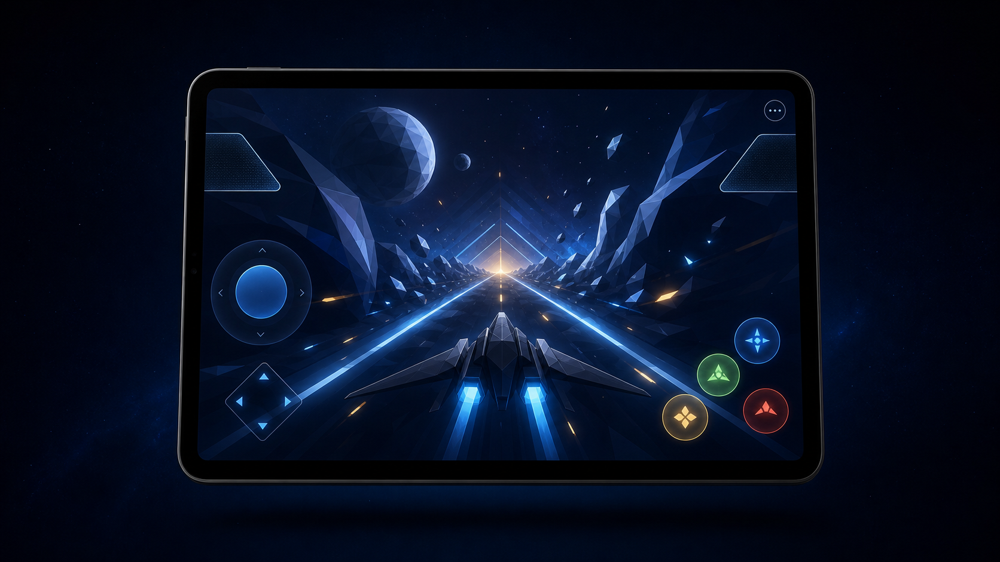
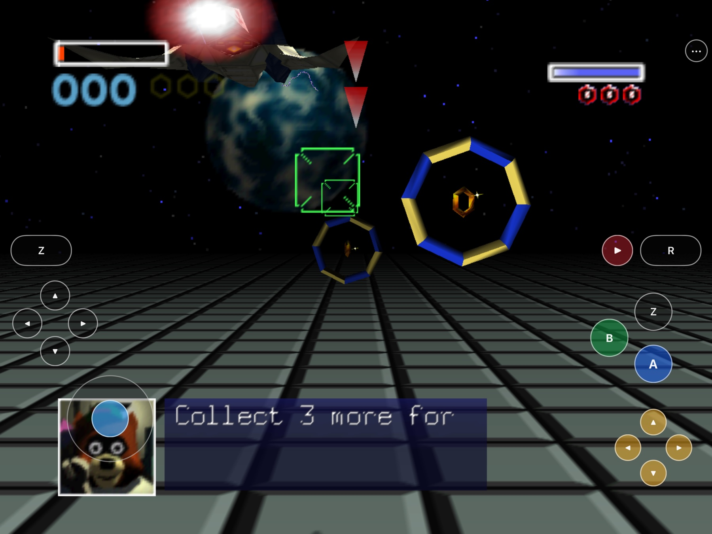
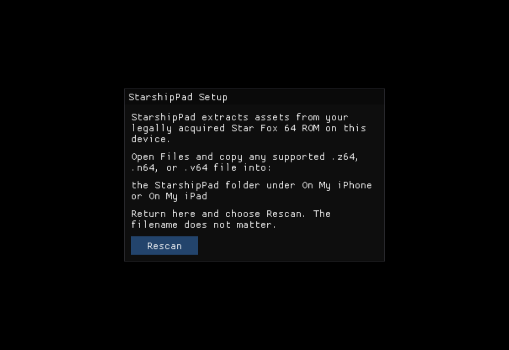
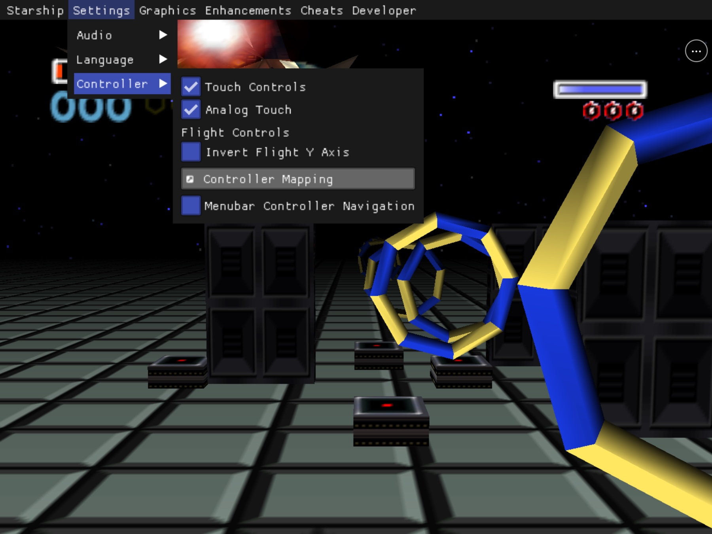
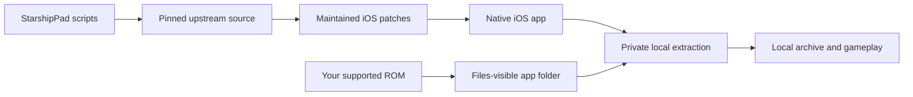

# StarshipPad

<p align="center">
  <strong>Star Fox 64 via HarbourMasters/Starship, rebuilt for iPhone and iPad.</strong><br>
  Native Metal rendering. Complete touch flight controls. Your game data stays
  yours.
</p>

<p align="center">
  
  
  
  
  
  
</p>



<p align="center">
  <sub>Original ROM-free project artwork. Current Simulator captures appear
  below; no ROM or extracted game asset is stored in this repository.</sub>
</p>

<p align="center">
  <a href="#get-started">Build</a> ·
  <a href="#first-flight">First flight</a> ·
  <a href="#touch-flight-deck">Touch controls</a> ·
  <a href="#current-screenshots">Screenshots</a> ·
  <a href="#what-works">Current status</a> ·
  <a href="docs/BUILDING.md">Full build guide</a>
</p>

StarshipPad packages the complete
[Starship](https://github.com/HarbourMasters/Starship) source port as a native
iOS/iPadOS application. It imports a user-provided supported Star Fox 64 ROM
through Files and adds an aim-first landscape controller derived from
HarkinianPad's proven UIKit touch component.

This repository contains the mobile integration, maintained source patches,
tests, and reproducible build scripts. It does **not** contain Star Fox 64, a
ROM, extracted Nintendo assets, or a playable ROM-derived archive.

<table>
  <tr>
    <td width="33%"><strong>Native iOS</strong><br>Metal rendering, system
    lifecycle integration, Files import, and the existing controller path.</td>
    <td width="33%"><strong>Touch-complete</strong><br>Every required flight,
    combat, menu, and wingman action is available on the glass.</td>
    <td width="33%"><strong>Reproducible</strong><br>Pinned upstream sources,
    maintained patches, ROM-free builds, and package audits.</td>
  </tr>
</table>

## Install status

| Option | Status | What it means |
|---|---|---|
| iPad Simulator | **Tested** | Best current path for development and UI validation; not physical-device proof |
| Local signed iPhone/iPad build | **Build path available** | Supply your own Apple development team and bundle identifier |
| Reproducible unsigned `.ipa` | **Audited locally** | Build artifact only; it cannot use the standard device-install path |
| Public signed download | **Not available** | No official downloadable signed build is published |
| App Store / TestFlight | **Not announced** | No listing or public beta exists |

The full touch action matrix, Files import, extraction, cached relaunch,
lifecycle persistence, iPhone layout, and iPad layout have been exercised in
Simulator. An unsigned arm64 iPhoneOS build and ROM-free package audit also
pass.

Physical-device installation, thumb feel, real-speaker audio, controller
models, reconnect, rumble, thermals, and performance remain open. GitHub
Actions is currently blocked before runner allocation by the account's
billing/spending state; this is recorded without presenting CI as green in
[`docs/remaining-work.md`](docs/remaining-work.md).

## Get started

You need:

- a Mac with Xcode and its command-line tools;
- [Homebrew](https://brew.sh);
- your own legally acquired supported Star Fox 64 ROM; and
- an Apple ID configured in Xcode only if you want a physical-device build.

Install build dependencies:

```sh
brew install cmake ninja pkgconf sdl2 glew nlohmann-json libzip \
  tinyxml2 libogg libvorbis
```

Clone and build:

```sh
git clone https://github.com/chrissotraidis/starshippad.git
cd starshippad

# iPad/iPhone Simulator
scripts/build-ios.sh --simulator

# Unsigned physical-device product
scripts/build-ios.sh --device
```

For a personally signed build:

```sh
DEVELOPMENT_TEAM=ABCDE12345 \
BUNDLE_ID=com.yourname.starshippad \
scripts/build-ios.sh --device
```

Replace `ABCDE12345` with your 10-character Apple development-team identifier
and use a bundle identifier registered to you. The Simulator and device
products are written to:

```text
build-ios-sim/Release-iphonesimulator/StarshipPad.app
build-ios/Release-iphoneos/StarshipPad.app
```

See
[`docs/BUILDING.md`](docs/BUILDING.md) for installation, signing, controller,
and package-audit details.

## First flight

StarshipPad never downloads or bundles game data.

1. Launch StarshipPad once so iOS creates its Files-visible folder.
2. Open **Files → On My iPad → StarshipPad**.
3. Move your supported `.z64`, `.v64`, or `.n64` file into that folder. The
   filename does not matter.
4. Return to StarshipPad and choose **Rescan**.
5. Keep the app foregrounded while it creates the private local archive.
6. Press the on-screen Start control when the title screen appears.

US inputs create the base local archive. Supported JP, EU, Spanish, and CN
inputs are routed to the Voice Pack path instead of being treated as an
unsupported base ROM. Extraction and generated data stay in the app
container.

## Touch flight deck

The flight deck is arranged for a landscape iPad held at both edges. It starts
with HarkinianPad's native-button, pass-through-overlay, safe-area, and
persistent-menu mechanism, then applies Star Fox-specific bindings and
continuous analog flight input.

- **Left grip:** bank-left Z, full D-pad, and analog flight stick.
- **Right grip:** R and Pause, A/B/Z face cluster, and the yellow C-button
  action diamond.
- **C diamond:** View up, Brake down, Boost left, Talk right.
- **Menu:** `•••` remains available even when gameplay controls are hidden.
- **Toggle:** **Settings → Controller → Touch Controls** removes or restores
  gameplay controls without a restart.
- **Fallback:** disabling Analog Touch preserves the complete eight-way
  keyboard path.

| Touch control | Action |
|---|---|
| Stick | Analog flight and aiming |
| A | Fire; hold for charge shot |
| B | Bomb |
| Z / R | Bank left/right; ordinary double-tap for barrel roll |
| C-Left / C-Down | Boost / Brake |
| Boost + stick-down | Somersault |
| Brake + stick-down | All-range U-turn |
| C-Up / C-Right | View / answer wingman |
| Start | Pause |
| D-pad | Full game/menu D-pad input |
| `•••` | Open or close the LibUltraShip menu |

All gameplay targets are safe-area aware and at least 44 points. Opening the
menu cancels held inputs and hides the flight deck; closing it restores the
deck only when Touch Controls remains enabled.

The exact layout, SDL bindings, accessibility contract, and evidence boundary
are documented in
[`docs/touch-controls-design.md`](docs/touch-controls-design.md).

## Current screenshots



<p align="center">
  <strong>Fly without a separate controller</strong><br>
  <sub>Training mode on iPad Simulator with analog flight, combat, D-pad,
  C-button, Pause, and persistent menu controls visible.</sub>
</p>

<table>
  <tr>
    <td width="50%">
      
    </td>
    <td width="50%">
      
    </td>
  </tr>
  <tr>
    <td align="center"><strong>Bring your own game</strong><br>The clean
    first-run screen directs you to the Files-visible StarshipPad folder.</td>
    <td align="center"><strong>Tune it while running</strong><br>Touch,
    analog aim, invert-Y, and controller mapping remain available in the
    persistent menu.</td>
  </tr>
</table>

These are current iPad Simulator captures using locally supplied game data.
They demonstrate the rendered application and its touch/menu integration, not
physical-device performance or control feel. No ROM, generated game archive,
or extracted game asset is included. Capture provenance and hashes are
recorded in [`docs/remaining-work.md`](docs/remaining-work.md).

## What works

| Area | Current result |
|---|---|
| Native app | arm64 iOS/iPadOS 16+ app builds through pinned Starship and LibUltraShip |
| Rendering | Metal title/game rendering passes on iPhone and iPad Simulator |
| Setup | Files import accepts supported `.z64`, `.v64`, and `.n64` files under any name |
| Extraction | Threaded in-app Torch extraction, responsive progress, cached relaunch |
| Regions | US base path plus JP/EU/Spanish/CN Voice Pack routing |
| Touch | Every required Star Fox action, analog aim, fallback, menu lifecycle |
| Lifecycle | Background pause, config flush, and save persistence on Simulator |
| Controllers | Existing SDL/GameController path is compiled; physical-model matrix remains open |
| Packaging | ROM-free port archive, unsigned IPA, forbidden-file and signed-package gates |

## Supported game

| Game | Engine | Status |
|---|---|---|
| **Star Fox 64** | [HarbourMasters/Starship](https://github.com/HarbourMasters/Starship) | Supported with a legally acquired matching ROM |
| Other Nintendo 64 games | Other source ports | Not supported by this application |

StarshipPad is a native source-port integration, not a general Nintendo 64
emulator. Unrelated N64 ROMs cannot be substituted for supported Star Fox 64
data.

## Reproducible and ROM-free



The compile never reads your ROM. `scripts/build-ios.sh` fetches exact
upstream revisions, disables their push URLs, applies the maintained patches,
generates and audits Starship's ROM-free `starship.o2r`, and builds the app.
Your ROM is introduced only after installation.

Before publishing or sharing a package:

```sh
scripts/check-repo-safety.sh
scripts/package-ios.sh
REQUIRE_SIGNED=1 scripts/package-ios.sh
```

The last command must reject the repository's intentionally unsigned
reproducibility artifact. A release candidate must instead contain a valid
signature and provisioning profile while still containing no ROM or
ROM-derived game archive.

## Frequently asked questions

<details>
<summary><strong>Where is the IPA?</strong></summary>

No official signed download is available. The build produces an audited
unsigned IPA under ignored `artifacts/`; it demonstrates reproducibility but
does not remove Apple's signing requirements.
</details>

<details>
<summary><strong>Does this repository include Star Fox 64?</strong></summary>

No. You must provide your own legally acquired supported ROM. Do not open
issues requesting game data or download links.
</details>

<details>
<summary><strong>Are these the HarkinianPad touch controls?</strong></summary>

Yes. StarshipPad ports the same native UIKit button/stick overlay,
safe-area/pass-through behavior, persistent menu button, and menu-visibility
lifecycle. Its labels and bindings are adapted for Star Fox, and its stick
adds a continuous SDL virtual-controller path for precision aiming.
</details>

<details>
<summary><strong>Can I hide touch controls and get them back?</strong></summary>

Yes. The persistent `•••` button keeps the menu reachable. Open
**Settings → Controller** and toggle **Touch Controls**. Analog Touch can be
disabled independently to use the eight-way fallback.
</details>

<details>
<summary><strong>Does it support physical controllers?</strong></summary>

Starship's existing SDL controller mappings and Apple's controller frameworks
are present. No MFi, Xbox, or PlayStation model has been physically verified
in this repository yet, so gameplay, reconnect, and rumble remain open.
</details>

<details>
<summary><strong>Is physical-device audio confirmed?</strong></summary>

No. SDL audio initialization is proven in Simulator, but speaker, headphone,
Bluetooth, interruption, and route-change behavior require physical hardware.
</details>

## Project map

| Path | Purpose |
|---|---|
| [`scripts/build-ios.sh`](scripts/build-ios.sh) | Complete Simulator or unsigned device build |
| [`scripts/package-ios.sh`](scripts/package-ios.sh) | Package, signature, and forbidden-data audit |
| [`scripts/check-repo-safety.sh`](scripts/check-repo-safety.sh) | Tree, history, patch, script, credential, and game-data gate |
| [`patches/`](patches/) | StarshipPad changes replayed onto exact upstream revisions |
| [`docs/BUILDING.md`](docs/BUILDING.md) | Build, signing, installation, and test guide |
| [`docs/touch-controls-design.md`](docs/touch-controls-design.md) | Touch geometry, bindings, and interaction contract |
| [`docs/RELEASE_CHECKLIST.md`](docs/RELEASE_CHECKLIST.md) | Source and package release gates |
| [`docs/LICENSES.md`](docs/LICENSES.md) | Final permissive dependency-license inventory |
| [`docs/remaining-work.md`](docs/remaining-work.md) | Authoritative evidence ledger and open hardware gates |
| [`docs/future-work.md`](docs/future-work.md) | Unimplemented Voice Pack, controller, and visual-pack follow-ups |
| `ref/` | Ignored local ROM/reference area; never published |

Generated sources, build directories, artifacts, ROMs, extracted assets, and
ROM-derived archives are ignored and rejected by the safety audit.

## Contributing and support

Read [`CONTRIBUTING.md`](CONTRIBUTING.md) before proposing a change and
[`SECURITY.md`](SECURITY.md) before reporting a sensitive vulnerability.
StarshipPad-specific issues belong in this repository, not in Starship,
LibUltraShip, Torch, or their forks. Never attach or request game data.

## Legal and acknowledgements

StarshipPad is an unofficial community project. It is independent of and not
endorsed by Nintendo, HarbourMasters, Starship, LibUltraShip, or Torch.
Nintendo trademarks and copyrights belong to Nintendo.

StarshipPad-owned work is MIT licensed. It builds on Starship, LibUltraShip,
Torch, SDL, and their contributors; every upstream component retains its own
license and copyright. See [`docs/LICENSES.md`](docs/LICENSES.md).
