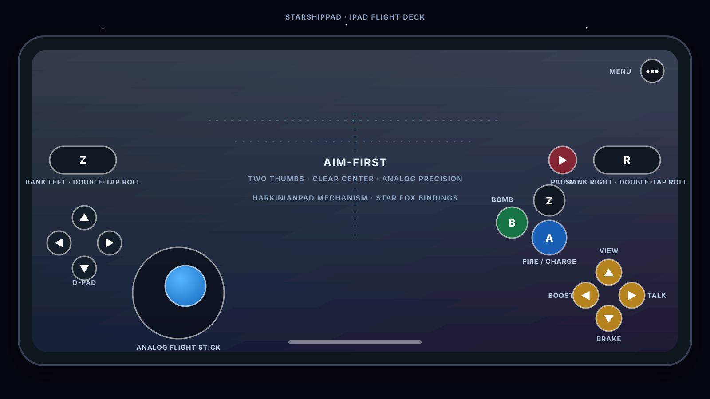

# StarshipPad touch controls

StarshipPad uses the proven HarkinianPad UIKit control mechanism: native
buttons post SDL input, the overlay passes through empty space, the layout
respects safe areas, gameplay controls disappear while the LibUltraShip menu
is open, and the independent `•••` button always keeps that menu reachable.

The geometry and bindings are adapted for Star Fox 64. The center of the
screen remains clear for aiming while both control groups sit in the lower,
grip-reachable bands of a landscape iPad.

## Layout contract

- The flight stick sits under the left thumb and reports continuous SDL
  virtual-controller axes when Analog Touch is enabled.
- The D-pad and all C/action buttons use at least 44-point touch targets.
- Z is available at the left shoulder and beside the right face cluster.
  Both copies emit the same bank-left input.
- Z and R support ordinary rapid double taps for barrel rolls.
- The yellow C diamond retains the original N64 direction symbols while its
  accessibility labels describe the Star Fox action.
- Opening the menu cancels held gameplay input before hiding the overlay.
- Disabling Touch Controls removes gameplay controls without removing `•••`.
- Disabling Analog Touch falls back to the complete eight-way keyboard path.

## Bindings

| Touch control | SDL binding | Star Fox action |
|---|---|---|
| Analog stick | Virtual left X/Y | Flight, aiming, menu navigation |
| Stick fallback | W/A/S/D | Eight-way flight and navigation |
| A | X | Fire; hold to charge |
| B | C | Bomb |
| Z, left and right copies | Z | Bank left; double-tap barrel roll |
| R | R | Bank right; double-tap barrel roll |
| C-Left | Left arrow | Boost; combine with stick-down for somersault |
| C-Down | Down arrow | Brake; combine with stick-down for all-range U-turn |
| C-Up | Up arrow | View |
| C-Right | Right arrow | Answer wingman or radio call |
| Start | Space or Return | Pause |
| D-pad | T/G/F/H | Game and menu D-pad input |
| Menu | F1 | LibUltraShip menu |

## Accessibility

Every control has a semantic accessibility label. Hold is exposed only for
controls where sustained input matters. Double Tap is exposed only for Z and
R, where it maps to an actual barrel-roll gesture. The stick exposes
directional hold actions for Simulator and assistive-input validation.

Accessibility actions help exercise the overlay, but they are not substituted
for coordinate-based taps in the acceptance matrix.

## Evidence boundary

The current acceptance record lives in
[`remaining-work.md`](remaining-work.md). Simulator checks establish layout,
event delivery, menu lifecycle, and gameplay response. They do not establish
physical thumb comfort, glass friction, simultaneous-touch feel, thermals, or
device audio; those require a physical iPad.
